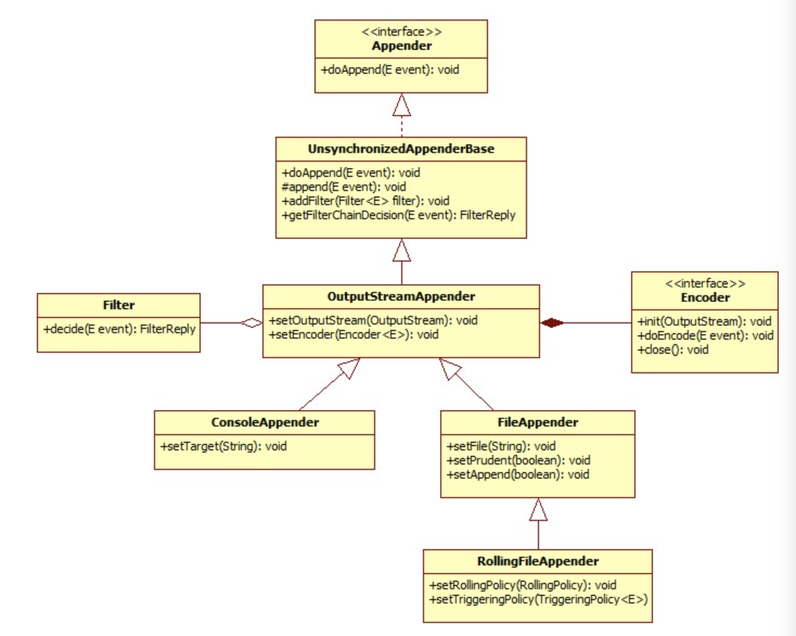

## What is an Appender?

**Logback은 로깅 이벤트를 작성하는 작업을 `Appender`라는 컴포넌트에 위임한다.** `Appender`는 ```ch.qos.logback.core.Appender``` 인터페이스를 구현한다.

```
package ch.qos.logback.core;

import ch.qos.logback.core.api.ContextAware;
import ch.qos.logback.core.spi.FilterAttachable;
import ch.qos.logback.core.spi.LifeCycle;

public interface Appender<E> extends LifeCycle, ContextAware, FilterAttachable {

  public String getName();
  public void setName(String name);
  void doAppend(E event);
}
```

`setter`, `getter`과 E타입 파라미터를 유일하게 받는 `doAppender()`메소드가 존재한다. 실제 `E` 타입에 해당하는 타입은 로그백 모듈에 따라 달라진다.

- `logback-classic`: E는 `ILoggingEvent`
- `logback-access`: E는 `AccessEvent`

`doAppend()`는 Logback 프레임워크에서 가장 중요한 역할을 하는 메소드인데, 적절한 형태로 가공된 로깅 이벤트를 적절한 디바이스로 출력하는 역할을 담당한다.

`Appender`들은 엔티티라고 불리는데, `Appender`들이 그들의 이름으로 참조될 수 있음을 보장해준다. 이 특징은 설정 파일에서 사용될 수 있다. `Appender` 인터페이스는 **`FilterAttachable` 인터페이스를 상속하는데, 이로 이해 하나 이상의 필터(Filter)를 Appender 인스턴스에 붙일 수 있다.** `Appender` 로깅 이벤트를 출력할 책임이 있으나 실제 로깅 이벤트의 포맷 변경은 `Layout`, `Encoder` 객체로 위임한다. 각 `Layout`, `Encoder`는 오직 하나의 `Appender`에만 연결될 수 있다. 몇몇 `Appender`는 빌트인 포맷이나, 고정된 이벤트 포맷이 존재하므로 `Layout`, `Encoder`를 필수적으로 사용하지 않아도 된다. 예를 들어, `SocketAppender`는 네트워크를 통해 전송하기 전에 단순히 로깅 이벤트를 직렬화한다.

## AppenderBase

`ch.qos.logback.core.AppenderBase` 클래스는 `Appender` 인터페이스르르 구현한 추상 클래스다. 이 클래스는 이름을 세팅하고 가져오기 위한 메소드(getter/setter), 활성화 상태, 현재 상요중인 Layout과 필터를 가져오기 등 대부분의 `Appender`에서 사용되는 기본적인 기능을 제공해준다. **`Logback`에 포함되는 모든 `Appender`의 상위 클래스다.** 비록 추상 클래스긴 하나, `Append`인터페이스에 있는 `doAppend()`를 구현했다.

```
public synchronized void doAppend(E eventObject) {
  // prevent re-entry.
  if (guard) {
    return;
  }

  try {
    gaurd = true;

    if (!this.started) {
      if (statusRepeatCount++ < ALLOWED_REPEATS) {
        addStatus(new WarnStatus(
          "Attempted to append to non started appender [" + name + "].", this ));
      }
      return;
    }

    if (getFilterChainDecision(eventObject) == FilterReply.DENY) {
      return;
    }

    // ok, we now invoke the derived class's implementation of append
    this.append(eventObject);
  } finally {
    guard = false;
  }
}
```

```doAppend()``` 메소드는 동기화되있으므로 다른 스레드에서 동일한 `Appender`에 로깅 요청을 하더라도 스레드 안정성이 보장된다. 예를 들어, T 스레드가 ```doAppend()``` 메소드를 실행 중이고 끝나기 전에, 이후의 다른 스레드가 호출한 ```doAppend()``` 호출이 큐에 들어간 경우 오직 T만 `Appender`에 접근할 수 있도록 허용해준다.

하지만 위와 같은 동기화가 언제나 적절하진 않으므로, `Logback`은 ```AppenderBase```와 비슷한 ```ch.qos.logback.core.UnsynchronizedAppenderBase```도 제공한다. 하지만 여기서는 `UnsynchronizedAppenderBase`를 다룬다.

```doAppend()``` 메소드가 하는 첫 번째 작업은 `guard` 플래그가 `true`인지 확인하는 것이다. 만약 그렇다면 이 전에 존재했다는 것이고, `false`라면 `true`로 세팅된다. `guard` 플래그는 ```doAppend()``` 메소드가 재귀적으로 자신을 호출하지 않도록 보장해준다. ```append()``` 메소드 이후에 다른 컴포넌트가 로깅을 시도한다고 가정해보자. 이는 또 다시 해당 컴포넌트를 호출했던 `Appender`로 요청될 수 있다. 결국 무한 루프가 발생하고, 스택 오버플로우가 발생하게 된다.

그 다음에는 `started` 필드가 true인지 확인한다. 만약 `false`라면 ```doAppend()```는 경고 메세지를 보내고 리턴된다. 다시 말해, **`Appender`가 닫히면, 이를 통해 로깅을 할 수 없다.** `Appender` 객체는 `LifeCycle` 인터페이스를 구현하므로 ```start()```, ```stop()```, ```isStarted()``` 메소드가 존재한다. `Appender`의 모든 프로퍼티를 세팅한 이후에, `Logback`의 설정 프레임워크인 `Joran`은 ```start()``` 메소드를 호출해서 `Appender`에 프로퍼티들을 활성화시키라는 시그널을 보낸다. `Appender` 종류에 따라서 만약 특정 프로퍼티가 없거나, 프로퍼티 사이들의 충돌 때문에 `Appender`가 시작을 못하고 실패할 수 있다. 

만약 `Appender`가 시작될 수 없거나, 이미 중지됐다면 `Logback`의 내부 상태 관리 시스템에 의해 경고 메세지가 출력된다. 몇번의 시도 후에, 내부 상태 시스템으로 동일한 경고 메세지가 쏟아지는 걸 방지하기 위해 ```doAppend()```메소드는 해당 경고 출력을 멈춘다.

다음 분기문은 붙어있는 필터들의 결과를 확인한다. 필터 체인으로부터의 결과에 의존해서, 이벤트들은 거절될 수도 받아들여질 수도 있다. 필터 체인 결과가 없다면 디폴트로 이벤트는 받아들여진다.

그리고 ```doAppend()``` 메소드는 하위 클래스 구현체의 ```append()``` 메소드를 호출한다. 이 메소드는 실제로 이벤트를 적절한 디바이스에 출력하는 작업을 수행한다.

최종적으로 `guard`는 `false`로 변경된다. 즉, 잠금을 해제함으로써 이후에 ```doAppend()``` 메소드를 호출할 수 있도록 한다.

# Logback-core

`Logback-core` 는 다른 `Logback` 모듈들의 기반이 된다. 일반적으로 `Logback-core`에 있는 컴포넌트들은 커스텀화를 필요로한다. 하지만 이 밑으로는 즉시 사용할 수 있는 `Appender`들을 설명한다.

## OutputStreamAppender

`OutputStreamAppender`는 이벤트를 ```java.io.OutputStream```에 이벤트를 출력한다. 이 클래스는 `Appender`의 기반이 되는 기본 서비스를 제공한다. 설정 파일에 `OutputStreamAppender`를 설정할 수 없으므로 사용자가 일반적으로 `OutputStreamAppender` 객체를 직접적으로 인스턴스화하지 않는다. 하지만 그럼에도 `OutputStreamAppender`에도 설정할 수 있는 프로퍼티들이 존재한다.

| Property name | Type | Description |
|---------------|------|-------------|
| encoder | Encoder | 이벤트가 `OutputStreamAppender`에 쓰여지는 방법을 결정한다. |
| immediateFlush | boolean | 디폴트 값은 `true`다. 로깅 이벤트를 즉시 출력함으로써 애플리케이션이 `Appender`를 닫지않고 종료되는 경우에도 로깅 이벤트를 잃지 않는다. 만약 `false`로 설정하면, 로깅 성능이 4배까지 증가한다. 하지만 `false`로 설정되고 애플리케이션이 종료될 때 `Appender`가 적절하게 닫히지 않는 경우에, 디스크에 쓰여지지 않은 로깅 이벤트는 소멸된다. |

`OutputStreamAppender`는 총 세 개의 `Appender`의 상위 클래스다. `ConsoleAppender`, `FileAppender`는 직접적으로 상속하며, `RollingFileAppender`는 `FileAppender`를 상속함으로써 간접적으로 `OutputStreamAppender`를 간접적으로 상속한다. 



## ConsoleAppender

이름에서 알 수 있듯, `ConsoleAppender`는 *System.out*(기본적으로 여기서 출력된다.), *System.err*와 같은 콘솔에 출력한다. `ConsoleAppender`는 유저가 명시한 인코더의 도움으로 이벤트의 포맷화한다. *System.out*와 *System.err*은 모두 ```java.io.PrintStream``` 패키지에 속한다. 두 가지 모두 I/O에 버퍼링 기능을 제공하는 `OutputStreamWriter`에 래핑되있다.

| Property Name | Type | Description |
| encoder | Encoder | OutputStreamAppender와 동일 |
| target | String | *System.out*, *System.err* 둘 중 하나인 문자열 값 |
| withJansi | boolean | 디폴트로 false로 설정된다. `true`로 설정하면 윈도우 컴퓨터에서 ANSI 색 코드를 지원하는 라이브러리인 `Jansi`를 활성화시킨다. 윈도우에서 해당 옵션이 true로 설정되있으면 클래스패스에 ```org.fusesource.jansi:jansi:1.18```이 있어야한다. Linux나 Mac OS X와 같이 리눅스 기반 OS에서는 ANSI 색 코드를 디폴트로 지원한다. |

아래는 `ConsoleAppender`를 사용하는 샘플 설정이다.

```
<configuration>
  <appender name="STDOUT" class="ch.qos.logback.core.ConsoleAppender">
    <!-- 
    encoders are assigned the type ch.qos.logback.classic.encoder.PatternLayoutEncoder by default
    -->
    <encoder>
      <pattern>%-4relative [%thread] %-5level %logger{35} - %msg %n</pattern>
    </encoder>
  </appender>

  <root level="DEBUG">
    <appender-ref ref="STDOUT">
  </root>
</configuration>
```

## FileAppender

`OutputStreamAppender`의 하위 클래스이며, 로그 이벤트를 파일에 출력한다. 타켓이 되는 파일은 `file`옵션에 명시하면된다. 만약 파일이 이미 존재하면 `append` 프로퍼티 값에 따라서 뒤에 추가하거나(Append), 기존 파일의 처음부터 새롭게 쓸 수 있다.(Truncate)

| Property Name | Type | Description |
|---------------|------|-------------|
| append | boolean | 참이면 이미 존재하는 파일 내용의 가장 뒤에서부터 이벤트를 추가하며, 거짓이면 이미 존재하던 파일은 내용이 사라진다. 디폴트는 참이다. |
| encoder | Encoder | OutputStreamAppender 와 동일 |
| file | String | 로그 이벤트를 출력할 파일 이름. 파일이 없으면 새로 만들어진다. 윈도우에서 `\t`는 이스케이프 문자(탭)로 해석될 수 있으므로 `c:\temp\test.log`가 제대로 해석되지 않을 수 있다. `c:/temp/test.log`나 `c:\\temp\\test.log`로 명시함으로써 적절하게 쓸 수 있다. `File` 옵션의 디폴트 값은 존재하지 않는다. 만약 파일의 부모 디렉터리가 존재하지 않으면 `FileAppender`는 자동으로 생성해준다. |
| prudent | boolean | 참이면 다른 JVM에서(일반적으로 다른 호스트에 있을 수 있는) `FileAppender`가 실행 중이더라도 안전하게 지정된 파일에 출력할 수 있다. 디폴트 값은 `false`다.

몇몇 제약이 있을 수 있으나 `RollingFileAppender`와 함께 사용할 때 유용할 수 있다. prudent 모드는 `append` 프로퍼티가 참으로 설정됐다는 것을 내포한다. 

`Prudent`는 배타적 파일 잠금(Exclusive file lock)에 의존한다. 실험을 보면, 파일 잠금은 로깅 이벤트 비용을 세 배까지 증가시킨다. 평균적인 PC에서 `prudent` 모드가 아닌 경우, 로컬 하드 디스크에 위치한 파일에 로깅 이벤트를 출력하는데 약 10ms가 걸리는 반면, `prudent` 모드인 경우엔 30ms가 소요된다. 즉, `prudent` 모드가 off인 경우 1초당 100,000개의 이벤트 로그를 처리할 수 있는 반면, on인 경우 초당 약 33,000 이벤트 로그를 처리할 수 있다.

`Prudent` 모드는 동일한 파일에 작업하는 모든 JVM 사이에서 발생하는 I/O를 효율적으로 "직렬화한다". 따라서 파일에 접근하기 위해 경쟁하는 JVM이 많아질 수록 각 I/O 명령에 의해 발생하는 지연도 커진다. 초당 20개의 I/O가 발생하는 경우 성능에 미치는 영향은 미미하지만, 초당 100번 이상의 I/O를 발생시키는 애플리케이션은 성능에 영향을 받을 수 있으며, `Prudent` 모드 사용을 자제해야한다.

로그 대상 파일이 네트워크 파일 시스템에 있는 경우, `prudent` 모드로 인한 비용은 더 커진다. 또 중요한건, 네트워크 상에 존재하는 파일 시스템에 대한 파일 잠금은 편향될 수 있다. 즉, 현재 잠금을 갖고있는 프로세스가 잠금을 해제하자마자 다시 잠금을 얻을 확률이 높다. 따라서 프로세스가 로그 파일에 대해 잠금을 사용하는 동안 다른 프로세스는 기다리다가 교착 상태에 빠지게 된다. |

아래는 `FileAppender` 에 대한 설정 파일 예시다.

```
<configuration>
  <appender name="FILE" class="ch.qos.logback.core.FileAppender">
    <file>testFile.log</file>
    <append>true</append>
    <!-- set immediateFlush to false for much higher logging throughput -->
    <immediateFlush>true<immediateFlush>
    <!-- 
    encoders are assigned the type ch.qos.logback.classic.encoder.PatternLayoutEncoder by default
    -->
    <encoder>
      <pattern>%-4relative [%thread] %-5level %logger{35} - %msg%n</pattern>
    </encoder>
  </appender>

  <root level="DEBUG">
    <appender-ref ref="FILE">
  </root>
</configuration>
```

위 파일이 `src/main/java/chapters/appenders/conf/logback-fileAppender.xml`에 위치한다고 할 때, 아래와 같이 실행할 수 있다.

```
java chapters.appenders.ConfigurationTester src/main/java/chapters/appenders/conf/logback-fileAppender.xml
```

### Uniquely named files (by timestamp)

개발 환경인 애플리케이션이나 배치 애플리케이션같이 생애주기가 짧은 애플리케이션의 경우, 애플리케이션이 실행될 때마다 로그 파일을 생성하는 것이 좋을 수도 있다. 이런 기능은 `<timestamp>` 요소로 쉽게할 수 있다.

```
<configuration>
  <!-- 
  Insert the current time formatted as "yyyyMMdd'T'HHmmss" under the key "bySecond" into the logger context. This value will be available to all subsequent configuration elements.
  -->
  <timestamp key="bySecond" dataPattern="yyyyMMdd'T'HHmmss />

  <appender name="FILE" class="ch.qos.logback.core.FileAppender">
    <!-- 
    use the previously created timestamp to create a uniquely named log file
    -->
    <file>log-${bySecond}.txt</file>
    <encoder>
      <pattern>%logger{35} - %msg%n</pattern>
    </encoder>
  </appender>

  <root level="DEBUG">
    <appender-ref ref="FILE">
  </root>
</configuration>
```

`<timestamp>` 요소는 두 개의 필수 속성인 *key*, *dataPattern*와 선택적으로 설정할 수 있는 *timeReference* 속성을 갖는다. 

- **key**: 키의 이름이며, 이 이름으로 이후의 설정 파일 요소에서 타임스탬프를 변수처럼 사용할 수 있다.
- **dataPattern**: 현재 시간을 문자열로 변환하기 위한 데이터 패턴을 의미한다.
- **timeReference**: 타임스탬프에 대한 참조를 의미한다. 디폴트는 현재 시간 등 설정 파일의 시간을 해석/파싱한다. 하지만 특정 상황에서 컨텍스트의 최초 시간을 *timeReferece*로 사용할 수도 있는데 이 경우엔 *timeReference*를 "contextBirth"로 설정하면된다.

로거 컨텍스트의 최초 시간을 `timeReference`로 사용하려면 아래와 같이 쓰면된다.

```
<configuration>
  <timestamp key="bySecond" datePattern="yyyyMMdd'T'HHmmss" timeReference="contextBirth">
  ...
</configuration>
```

## RollingFileAppender

`RollingFileAppender`는  `FileAppender`를 상속하며 로그 파일을 변경할 수 있다. 예를 들어, `RollingFileAppender`는 `log.txt`이라는 이름의 파일에 로그를 기록할 수 있으며, 어떤 조건이 만족되면 타겟이되는 파일을 다른 파일로 변경할 수 있다.

`RollingFileAppender`와 상호작용하는 두 가지 중요한 하위 컴포넌트가 있다. 

- **RollingPolicy**: rollover에 필요한 행동을 맡는다.(**what**)
- **TriggeringPolicy**: 언제 정확히 rollover가 발생할지 결정한다.(**when**)

`RollingFileAppender`는 `RollingPolicy`와 `TriggeringPolicy`를 모두 세팅해서 갖고있어야 한다. 하지만 `RollingPolicy`가 `TriggeringPolicy`를 구현했으면 `RollingPolicy`만 명시되면된다.

아래는 `RollingFileAppender`에 사용할 수 있는 속성들이다.

| Property Name | Type | Description |
|---------------|------|-------------|
| file | String | FileAppender와 동일 |
| append | boolean | FileAppender와 동일 |
| encoder | Encoder | OutputStreamAppender와 동일 |
| rollingPolicy | RollingPolicy | rollover가 발생했을 때, RollingFileAppender에게 명령할 RollingPolicy 컴포넌트 명시 |
| triggeringPolicy | TriggeringPolicy | RollingFileAppender에게 언제 rollover를 할지 알려주는 TriggeringPolicy 컴포넌트 명시 |
| prudent | boolean | `FixedWindowRollingPolicy`는 `prudent` 모드에서 지원되지 않는다. `RollingFileAppender`는 `TimeBasedRollingPolicy`와 함께 사용할 때`prudent` 모드를 지원한다. 아래 두 가지 제약이 있다.

1. `prudent` 모드에서 파일 압축은 지원되지 않고, 허용되지도 않는다. 하나의 JVM은 파일에 쓰지않고, 다른 JVM은 이걸 압축할 수 없다.
2. `FileAppender`의 `file` 속성은 세팅될 수 없으며 빈 상태로 남아있어야 한다.

### Overview of rolling policies

`RollingPolicy`는 rollover 처리에 대한 책임이 있다. 파일 이동과 이름 변경 과정이 포함된다. `RollingPolicy` 인터페이스는 아래와 같다.

```
package ch.qos.logback.core.rolling;

import ch.qos.logback.core.FileAppender;
import ch.qos.logback.core.spi.LifeCycle;

public interface RollingPolicy extends LifeCycle {

  public void rollover() throws RolloverFailure;
  public String getActiveFileName();
  public CompressionMode getCompressionMode();
  public void setParent(FileAppender appender);
}
```

- ```rollover()```: 현재 로그 파일을 아카이빙 하기 위한 작업을 한다.
- ```getActiveFileName()```: 현재 로그 파일의 이름을 얻기 위해 사용된다.
- ```getCompressionMode()```: 압축 모드를 결정하기 위해 사용된다.
- ```setParent()```: `RollingPolicy`는 이 메소드로 부모에 대한 참조를 갖을 수 있다.

#### TimeBasedRollingPolicy

`TimeBasedRollingPolicy`는 가장 널리 쓰이는 롤링 정책이다. 이 클래스는 일/월 등 시간에 기반해서 rollover 정책을 정의한다. `TimeBasedRollingPolicy`는 rollover와 rollover를 유발하기 위한 책임을 말해준다. `TimeBasedTriggeringPolicy`는 `RollingPolicy`와 `TriggeringPolicy` 인터페이스를 모두 구현한다. `TimeBasedTriggeringPolicy`는 *fileNamePattern*이라는 필수 속성과 여러가지 선택적 속성을 갖는다.

TODO

아래는 `fileNamePattern` 의 값을과 예시다.

TODO

앞뒤로 붙는 '/' 문자는 디렉터리 구분자로 해석된다. 부모 레벨에 존재하지 않는 디렉터리는 자동으로 생성된다. 따라서 분리된 디렉터리에 로그 파일을 편하게 위치시킬 수 있다.

`TimeBasedRollingPolicy`는 자동 파일 압축을 지원한다. 이 기능은 `fileNamePattern` 옵션이 `.gz`, `.zip`등으로 끝나면 활성화된다.

TODO

`fileNamePattern`은 두 가지 기능을 한다.

- `Logback`은 요청된 rollover 주기를 계산한다.
- 아카이빙된 파일 이름을 계산한다.

두 가지 다른 패턴에 대해서 동일한 주기를 설정할 수 있다. 비록 아카이빙된 파일 이름은 다르겠지만 `yyyy-MM`과 `yyyy@MM`은 모두 월 주기 rollover를 명시하는 것이다. 

`file` 프로퍼티를 세팅함으로써, 활성화된 로그 파일의 위치와 아카이빙된 로그 파일의 위치를 분리할 수 있다. 로그 출력 결과는 `file` 프로퍼티에 명시된 파일로 간다. 아카이브 로그 파일의 이름은 변하지 않는다. 하지만, `file`프로퍼티를 생략하면, 현재 활성화된 파일 이름은 `fileNamePattern`의 값에 기반해서 주기적으로 새로 계산된다. `file` 옵션을 세팅하지 않음으로써, 파일 이름 재설정 에러(file renaming errors)를 방지할 수 있다.

`maxHistory` 프로퍼티는 보관할 아카이브 파일의 최대 개수를 지정한다. 오래된 파일 순서대로 삭제한다. 예를 들어, 월 주기 rollover를 지정하고 `maxHistory`를 6으로 설정하면 6개월 동안의 아카이브 파일들만 유지되고 6개월보다 오래된 파일들은 삭제된다. 오래된 아카이브 로그 파일들은 지워지고 로그 파일 아카이빙을 위한 용도로 생성된 디렉터리도 적절하게 지워진다.

여러가지 기술적인 이유로, rollover는 시계열(clock-driven)에 의존하지 않고 로깅 이벤트 도착에 의존한다. 예를 들어, `2002.3.8`에 대해서 `fileNamePattern`이 `yyyy-MM-dd`로 세팅되있다고 가정하면, 일 주기로 세팅된 것이므로 자정이 지난 뒤 첫 이벤트가 발생한다. 자정이 지난 뒤 23분 47초뒤에야 로깅 이벤트가 처음 발생하면 rollover는 `2002.3.8 00:23'47 AM`에 발생하며 `0:00 AM`에 발생하지 않는다. 따라서 이벤트 도착 주기에 따라서, rollover는 지연되서 실행된다. 지연에 상관없이 rollover 알고리즘은 합당하다. 특정 기간동안 발생한 로깅 이벤트는 그 기간으별로 올바른 파일로 들어갈 것이기 때문이다.

아래는 `TimeBasedRollingPolicy`와 함께 `RollingPolicy`를 사용할 때 설정 파일의 예시다.

```
<configuration>
  <appender name="FILE" class="ch.qos.logback.core.rolling.RollingFileAppender">
    <file>logFile.log<file>
    <rollingPolicy class="ch.qos.logback.core.rolling.TimeBasedRollingPolicy">
      <!-- daily rollover -->
      <fileNamePattern>logFile.%d{yyyy-MM-dd}.log</fileNamePattern>

      <!-- keep 30 days' worth of history capped at 3GB total size-->
      <maxHistory>30</maxHistory>
      <totalSizeCap>3GB</totalSizeCap>
    </rollingPolicy>

    <encoder>
      <pattern>%-4relative [%thread] %-5level %logger{35} - %msg%n</pattern>
    </encoder>
  </appender>

  <root level="DEBUG">
    <appender-ref ref="FILE />
  </root>
</configuration>
```

아래 설정 예시는 `prudent` 모드인 `TimeBasedRollingPolocy`를 사용하는 `RollingFileAppender` 설정 예시를 보여준다.

```
<configuration>
  <appender name="FILE" class="ch.qos.logback.core.rolling.RollingFileAppender">
    <!-- Support multiple-JVM writing to the same log file -->
    <prudent>true</prudent>
    <rollingPolicy class="ch.qos.logback.core.rolling.TimeBasedRollingPolicy">
      <fileNamePattern>logFile.%d{yyyy-MM-dd}.log</fileNamePattern>
      <maxHistory>30</maxHistory>
      <totalSizeCap>3GB</totalSizeCap>
    </rollingPolicy>

    <encoder>
      <pattern>%-4relative [%thread] %-5level %logger{35} - %msg%n</pattern>
    </encoder>
  </appender>

  <root level="DEBUG">
    <appender-ref ref="FILE />
  </root>
</configuration>
```

### Size and time based rolling policy

때떄로 파일을 날짜별로 파일을 아카이빙하지만 로그 파일의 사이즈를 제한하고 싶을 수 있다. 특히 후처리 툴의 경우 로그 파일에 사이즈 제한을 두는 경우에 더 필요하다. 이 요구 사항을 충족하기 위해, `logback`은 `SizeAndTimeBasedRollingPolicy`를 지원한다.

`SizeAndTimeBasedRollingPolicy`는 아카이빙된 로그 파일들의 결합된 사이즈를 제한해준다. 만약 아카이빙된 로그 파일들의 총 합의 크기만을 제한하고 싶다면 `TimeBasedRollingPolicy`와 `totalSizeCap` 프로퍼티를 적절하게 설정해야한다.

아래는 시간과 크기에 기반한 로그 파일 아카이빙 예시다.

```
<configuration>
  <appender name="ROLLING" class="ch.qos.logback.core.rolling.RollingFileAppender">
    <file>mylog.txt</file>
    <rollingPolicy class="ch.qos.logback.core.rolling.RollingFileAppender">
      <!-- rollover daily -->
      <fileNamePattern>mylog-%d{yyyy-MM-dd}.%i.txt</fileNamePattern>
      <!-- each file should be at most 100MB, keep 60 days worth of history, but at most 20GB -->
      <maxFileSize>100MB</maxFileSize>
      <maxHistory>60</maxHistory>
      <totalSizeCap>20GB</totalSizeCap>
    </rollingPolicy>
    <encoder>
      <pattern>%msg%n</pattern>
    </encoder>
  </appender>

  <root level="DEBUG">
    <appender-ref ref="ROLLING" />
  </root>
</configuration>
```

"%i" 변환토큰과 "%d"은 모두 필수요소다. 현재 시간 주기가 끝나기 전에 로그 파일이 `maxFileSize`에 도달할 때마다 파일은 아카이빙되고 인덱스가 증가한다.

크기와 시간에 기반한 아카이빙은 오래된 아키이브 파일을 삭제한다. `maxHistory` 프로퍼티로 파일을 유지할 기간을 지정할 수 있다. 애플리케이션이 중지하거나 재시작될 떄마다, 로깅은 정확한 위치에서 계속 진행된다. 예를 들어, 현재 주기에 해당하는 가장 큰 인덱스다.

### FixedWindowRollingPolicy

rollover 될 때마다. `FixedWindowRollingPolicy`는 고정 윈도우 알고리즘에 따라 파일 이름을 재설정한다.

`fileNamePattern` 옵션은 아카이브된 로그 파일들을 위한 파일 이름 패턴을 지정한다. 이 옵션은 필수 요소이며, Integer 토큰인 %i 를 패턴 어딘가에 포함해야한다.

아래는 `FixedWindowRollingPolicy`를 위해 사용할 수 있는 프로퍼티들이다.

TODO

고정 윈도우 롤링 정책이 윈도우 크기만큼 파일 이름 재설정 명령을 실행해야하는 점을 고려할 떄, 큰 윈도우 사이즈는 좋지않다. 만약 큰 값을 설정하면 자동으로 윈도우 사이즈를 20으로 줄여준다.

고정 윈도우 롤오버 정책에 대한 구체적인 예를 보자. `minIndex`는 1로 설정되있고, `maxIndex`는 3으로 설정되있고, `fileNamePattern` 프로퍼티는 `foo%i.log`으로, `file` 프로퍼티는 `foo.log`로 설정되있다고 가정해보자.

TODO

아래는 `RollingFileAppender`와 `FixedWindowRollingPolicy`를 설정하는 설정 파일 예시다. `fileNamePattern`옵션에 명시된 정보과 같은 정보를 포함하더라도 `File` 옵션은 필수임을 유의한다.

```
<configuration>
  <appender name="FILE" class="ch.qos.logback.core.rolling.RollingFileAppender">
    <file>test.log</file>

    <rollingPolicy class="ch.qos.logback.core.rolling.FixedWindowRollingPolicy">
      <fileNamePattern>tests.%i.log.zip</fileNamePattern>
      <minIndex>1</minIndex>
      <maxIndex>3</maxIndex>
    </rollingPolicy>

    <triggeringPolicy class="ch.qos.logback.core.rolling.SizeBasedTriggeringPolicy">
      <maxFileSize>5MB</maxFileSize>
    </triggeringPolicy>

    <encoder>
      <pattern>%-4relative [%thread] %-5level %logger{35} - %msg%n</pattern>
    </encoder>
  </appender>

  <root level="DEBUG">
    <appender-ref ref="FILE" />
  </root>
</configuration>
```

### Overview of triggering policies

`TriggeringPolicy` 구현체는 `RollingFileAppender`에게 **언제** 롤오버를 해야하는지 알려줄 책임이 있다. `TriggeringPolicy` 인터페이스는 오직 하나의 메소드만 갖는다.

```
package ch.qos.logback.core.rolling;

import java.io.File;
import ch.qos.logback.core.spi.LifeCycle;

public interface TriggeringPolicy<E> extends LifeCycle {
  public boolean isTriggeringEvent(final File activeFile, file <E> event);
}
```

```isTriggeringEvent()``` 메소드는 파라미터로 로그 파일과 현재 처리중인 로깅 이벤트를 받는다. 구현체는 이 파라미터에 기반해서 롤오버가 발생해야할지 결정한다. 가장 널리 쓰이는 정책은 ```TimeBasedRollingPolicy```다. 


#### SizeBasedTriggeringPolicy

`SizeBasedTriggeringPolicy`는 현재 처리중인 파일의 사이즈를 확인한다. 만약 지정된 사이즈보다 크다면, 속해있는 `RollingFileAppender`에게 현재 활성화된 파일에 대해 롤오버를 진행하라고 알려준다.

`SizeBasedTriggeringPolicy`는 `maxFileSize`라는 단 하나의 파라미터를 받고, 디폴트 값은 10MB다.

`maxFileSize` 옵션은 byte, KB, MB, GB를 접미사로 사용함으로써 명시할 수 있다. 예를 들어, 5000000, 5000KB, 5MB, 2GB는 모두 유효한 값이며, 첫 세개는 동일하다.

`RollingFileAppender`를 로그 파일이 5MB에 도달했을 때 롤오버 정책을 유발하는 `SizeBasedTriggeringPolicy`과 사용할 때 설정 파일의 예시를 보여준다.

```
<configuration>
  <appender name="FILE" class="ch.qos.logback.core.rolling.RollingFileAppender">
    <file>test.log</file>
    <rollingPolicy class="ch.qos.logback.core.rolling.FixedWindowRollingPolicy">
      <fileNamePattern>test.%i.log.zip</fileNamePattern>
      <minIndex>1</minIndex>
      <maxIndex>3</maxIndex>
    </rollingPolicy>

    <triggeringPolicy class="ch.qos.logback.core.rolling.SizeBasedTriggeringPolicy">
      <maxFileSize>5MB</maxFileSize>
    </triggeringPolicy>

    <encoder>
      <pattern>%-4relative [%thread] %-5level %logger{35} - %msg%n</pattern>
    </encoder>
  </appender>

  <root level="DEBUG">
    <appender-ref ref="FILE" />
  </root>
</configuration>
```


# Logback Classic

`logback-classic`에서 이벤트는 항상 `ILoggingEvent`다. `Logback-classic`은 `ILoggingEvent` 인스턴스들을 다루는 특화된 프로세싱 파이프라인이다.

## SocketAppender && SSLSocketAppender

TODO

### Logging Server Options

TODO

### Using SimpleSocketServer

TODO

### Using SimpleSSLSocketServer

TODO

### ServerSocketAppender and SSLServerSocketAppender

TODO

## SMTPAppender

TODO

### Custom buffer size

TODO

### Triggering event

TODO

### Marker based triggering

TODO

#### Marker-based triggering with JaninoEventEvaluator

TODO

#### Marker-based triggering with GEventEvaluator

TODO

### Authentication/STARTTLS/SSL

TODO

### SMTPAppender configuration for Gmail(SSL)

TODO

### SMTPAppender for Gmail(STARTTLS)

TODO

### SMTPAppender with MDCDiscriminator

TODO

#### Buffer management in very busy system.

TODO

## DBAppender

TODO

## SyslogAppender

TODO

## SiftingAppender

TODO

### Getting the timeout right

TODO

## AsyncAppender

`AsyncAppender`는 `ILoggingEvent`들을 비동기적으로 로깅한다. 오직 이벤트 디스패처로서의 역할만하면서 다른 `Appender`들을 참조해서 동작한다.

##### LOSSY BY DEFAULT IF 80% FULL

`AsyncAppender`는 블로킹 큐에 이벤트들을 버퍼링한다. `AsyncAppender`가 생성한 스레드는 큐의 헤더에 있는 이벤트를 가져와서 `AsyncAppender`에 붙어있는 `Appender`로 이벤트를 전달해준다. **단, 만약 큐의 80%가 차있는 상태라면, `AsyncAppender`는 TRACE, DEBUG, INFO 레벨의 이벤트를 버린다.** 이 전략은 이벤트 소실이 발생하는 대신 성능에 대한 뛰어난 효과를 가져온다.

##### APPLICATION STOP/REDEPLOY

애플리케이션이 종료되거나 재배포되면 `AsyncAppender`는 중지되야한다. 워커 스레드를 중지하고 자원을 회수하며 큐에 있는 로깅 이벤트들을 내보내기 위해서다. `AsyncAppender`를 포함한 모든 `Appender`를 닫도록 만드는 **로깅 컨텍스트 중지**를 통해 만들 수 있다. `AsyncAppender`는 `maxFlushTime`에 명시된 시간만큼만 워커 스레드가 큐의 이벤트들을 내보내는걸 기다린다. 만약 `LoggerContext`를 닫는 동안 큐에 있는 이벤트들이 소멸된다면 타임아웃 시간을 늘려야한다. `maxFlushTime`을 0으로 지정하면 `AsyncAppender`로 하여금 `stop()`로 인해 중지되기전 모든 큐에 있는 이벤트가 내보내지도록 강제한다.

###### POST SHUTDOWN CLEANUP

JVM 셧다운 모드에 따라, 큐에 있는 이벤트를 처리하는 워커 스레드가 영향을 받아서 큐에 있는 이벤트들이 그대로 남아있도록 만들 수도 있다. 이런 상황은 보통 `LoggerContext`가 깨끗하게 중지되지 않거나, JVM이 비정상적인 경로로 중지된 경우에 발생한다. 이런 상황에서 워커 스레드가 영향받지 않도록 하려면, JVM 셧다운이 시작된 후에 `LoggerContext`를 적절히 종료하는 셧다운 훅이 JVM 런타임에 추가될 수 있다. 

아래는 `AsyncAppender`에 대해 사용할 수 있는 프로퍼티들이다.

| Property Name | Type | Description |
|---------------|------|-------------|
| queueSize | int | 블로킹 큐의 최대 용량. 디폴트 값은 256이다. |
| discardingThreshold | int | 디폴트로 블로킹 큐가 오직 20%의 수용량만 남았다면, TRACE, DEBUG, INFO 레벨의 로그 이벤트들은 버리고, WARN, ERROR 레벨의 이벤트들만 갖고있는다. 모든 이벤트를 유지하려면 해당 옵션을 0으로 설정하면된다. |
| includeCallerData | boolean | 호출자의 데이터를 추출하는 것은 비싼 작업일 수 있다. 디폴트로  성능 향상을 위해 큐에 추가될 때, 해당 이벤트과 연관된 호출자의 데이터는 추출하지 않는다. 디폴트는 스레드 이름과 MDC같은 정보와 같이 싼 데이터만 복사된다. 해당 옵션을 true로 설정함으로써 `Appender`에게 호출자 데이터 추가를 강제할 수 있다. |
| maxFlushTime | int | 현재 큐에 있는 데이터의 개수와 참조하고 있는 `Appender`로의 지연에 따라서, `AsyncAppender`는 큐에 있는 데이터를 모두 내보내기 위해 매우 큰 시간을 할애할 수 있다. `LoggerContext`가 중지됐을 때, `AsyncAppender`의 ```stop()```메소드는 워커 스레드가 모든 이벤트를 내보낼 때까지 이 시간만큼 기다린다. 큐에 있는 데이터를 모두 내보내기 위한 타임아웃을 ms단위로 해당 옵션에 명시한다. 이 시간 내에 처리될 수 없는 이벤트들은 버려진다. 이 값의 의미는 `Thread.join(long)`의 파라미터와 동일한 역할을 한다. |
| neverBlock | boolean | 디폴트로 `false`인데 `false`인 경우, 큐가 꽉 차있을 때 메세지를 버리지않고 큐에 추가하기 위해 블로킹이 발생한다. `true`인 경우 큐가 가득 차있으면 메세지를 그냥 버리고 애플리케이션에 블로킹이 발생하지 않는다. |

디폴트로 이벤트큐는 최대 256개의 이벤트를 수용할 수 있도록 설정되있다. 큐가 꽉차면, 워커 스레드가 한 개 이상의 이벤트를 디스패치할 수 있을 때까지, 애플리케이션 스레드는 새로운 로깅을 하지 못하고 블로킹된다. 만약 큐가 꽉 차지 않았다면, 애플리케이션 스레드는 로깅 이벤트를 다시 출력할 수 있게된다. 따라서 이벤트 버퍼가 거의 꽉 찬 상태에서 `Appender`가 동작하고 있다면, 비동기 로깅 `Appender`는 동기적으로 동작한다. 하지만 이게 반드시 나쁜건 아니다. `Appender`는 버퍼에 대한 부하가 완화될 때까지 약간의 시간이 소요되지만, 애플리케이션은 동작을 계속 하도록 디자인됐다.

애플리케이션의 최대 처리량을 위해 `Appender`의 이벤트 큐를 최적으로 튜닝하는 것은 여러가지 요소에 달렸다. 다음 요소들로 인해 동기처럼 동작하는 방식이 애플리케이션에 영향을 줄 수 있다.

- 많은 수의 애플리케이션 스레드.
- 애플리케이션당 매우 많은 로깅 이벤트가 발생하는 경우.
- 로깅 이벤트당 많은 데이터가 포함되있는 경우.
- 자식 `Appender`의 지연

이를 해겨하기 위해 큐의 사이즈를 늘리면 되지만, 애플리케이션이 사용할 수 있는 힙의 크기는 줄어든다는 사이드 이펙트가 있다.

##### LOSSY BEHAVIOR

블로킹을 줄이기 위해서 큐 수용량이 20% 이하라면, `AsyncAppender`는 TRACE, DEBUG, INFO 레벨의 이벤트들은 버리고 WARN, ERROR 레벨의 이벤트들만 유지한다. 이 전략은 TRACE, DEBUG, INFO 레벨의 이벤트들이 소실될 수 있지만, 로깅 이벤트들을 논블로킹 방식으로 다룰 수 있도록 해준다. `discardingThreshold`를 0으로 설정함으로써 이 경우에 발생하는 이벤트 소실을 막을 수 있다.

```
<configuration>
  <appender name="FILE" class="ch.qos.logback.core.FileAppender">
    <file>myapp.log</file>
    <encoder>
      <pattern>%logger{35} - %msg%n</pattern>
    </encoder>
  </appender>

  <appender name="ASYNC" class="ch.qos.logback.classic.AsyncAppender">
    <appender-ref ref"FILE" />
  </appender>

  <root level="DEBUG">
    <appender-ref ref="ASYNC">
  </root>
</configuration>
```

### Writing your own Appender

`AppenderBase`를 상속함으로써 Custom Appender를 만들 수 있다. 필터, 상태 메세지 등 다른 `Appender`에서 쓰이는 기능들을 지원하도록 만들 수 있다. 상속하는 클래스는 ```append(Object eventObject)``` 메소드 하나만 구현하면된다.

예를 들어, 아래의 `CountingConsoleAppender`는 제한된 숫자의 이벤트만 콘솔로 출력하고 개수가 임계점에 도달하면 셧다운된다. 이벤트를 포맷화하기 위해서 `PatternLayoutEncoder`를 사용하며, `limit`이라는 이름의 파라미터를 받는다. 따라서 ```append(Object eventObject)```외에 몇 가지 메소드가 더 필요하다. 아래서 보듯이 이런 파라미터들은 `Logback`의 다양한 설정 매커니즘에 의해 자동으로 제어할 수 있다.

```
package chapters.appenders;

import java.io.IOException;

import ch.qos.logback.classic.encoder.PatternLayoutEncoder;
import ch.qos.logback.classic.spi.ILoggingEvent;
import ch.qos.logback.core.AppenderBase;

public class CoutingConsoleAppender extends AppenderBase<ILoggingEvent> {
  static int DEFAULT_LIMIT = 10;
  int counter = 0;
  int limit = DEFAULT_LIMIT;

  PatternLayoutEncoder encoder;

  public void setLimit(int limit) {
    this.limit = limit;
  }

  public int getLimit() {
    return limit;
  }

  @Override
  public void start() {
    if (this.encoder == null) {
      addError("No encoder set for the appender named [" + name +"].");
      return;
    }

    try {
      encoder.init(System.out);
    } catch (IOException e) {

    }
    super.start();
  }

  public void append(ILoggingEvent event) {
    if (counter >= limit) {
      return;
    }

    // output the events as formatted by out layout
    try {
      this.encoder.doEncode(event);
    } catch (IOException e) {

    }
    ++counter;
  }

  public PatternLayoutEncoder getEncoder() {
    return encoder;
  }

  public void setEncoder(PatternLayoutEncoder encoder) {
    this.encoder = encoder;
  }
}
```

```start()``` 메소드는 `PatternLayoutEncoder`가 있는지 확인해서 없는 경우엔 시작에 실패하고 에러를 출력한다. Custom `Appender`로 두 가지 포인트를 알 수 있다.

- setter/getter 자바빈 컨벤션을 따르는 모든 프로퍼티들은 `Logback` 설정자에 의해 투명하게 제어할 수 있다. `Logback` 설정 과정에서 자동으로 호출되는 ```start()``` 메소드는 `Appender`의 다양한 프로퍼티들이 세팅됐는지 확인해야할 책임이 있다.
- ```AppenderBase.doAppender()``` 메소드는 하위 클래스의 ```append()``` 메소드를 호출한다. 실제 출력 명령은 하위 클래스의 ```append()```에서 발생한다. 또한 `Appender`가 `Layout`을 호출함으로써 이벤트를 포맷화하는 것도 해당 메소드에서 발생한다.

`CountingConsoleAppender`는 다른 `Appender`들처럼 설정될 수 있다.

## Logback Access
